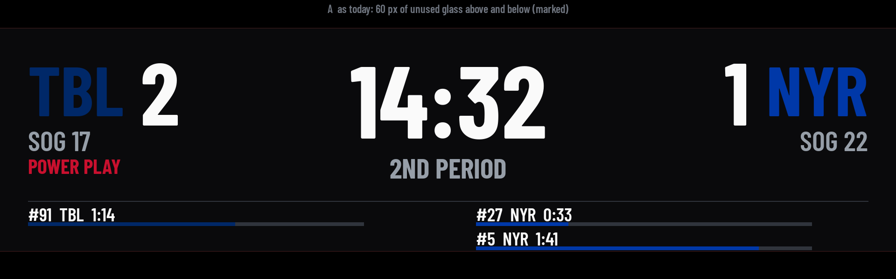
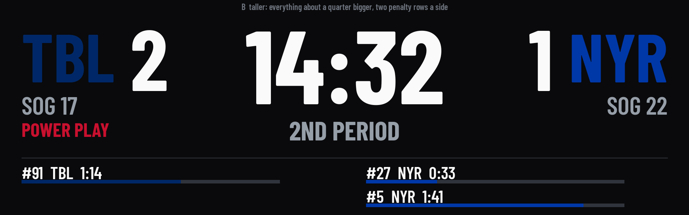
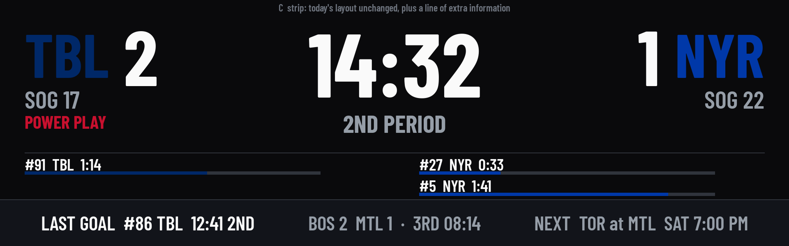
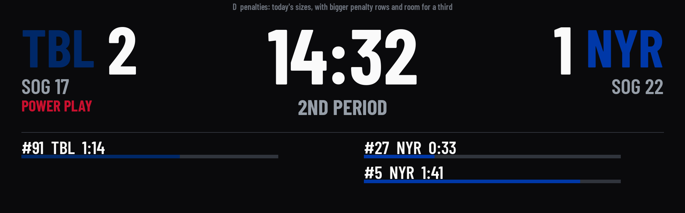

# Layout mock-ups for the real panel

**Chosen by the owner, 2026-09-21: C, the information strip.** The rest are kept as the record of what was considered. What C needs before it can be built is at the end.

The panel is 400x1280: **3.2:1**. The scoreboard frame is drawn at 1920x480,
which is 4:1, so turned and scaled it lands as 1280x320 with **40 px of unused
glass along each long edge** (measured 2026-09-19, `docs/hardware-checks.md`).

These are drawn at 1920x600, the panel's own shape, with the project's real
fonts and a real game state. They are pictures to choose from, **not
production code**: `render_mockups.py` draws them and nothing else uses it.

| | |
|---|---|
| **A** as today | The 4:1 frame with the unused bands marked. The baseline. |
| **B** taller | The same layout grown into the height: digits and names about a quarter bigger. Reads from further away. Two penalty rows a side. |
| **C** info strip | Today's layout untouched, and a strip underneath: last goal, another game, the next game. The strip's content needs data the panel does not get yet. |
| **D** penalties | Today's sizes, with bigger penalty rows and room for a third a side. The smallest text on the panel is the thing that grows. |

Whichever is chosen, two things come with it: the frame's height stops being a
constant (a panel that is 4:1 must still work), and the burn-in shift and the
stale-feed band are placed against the new layout and re-tested.

## What C needs

The strip shows three things. The panel has the first today, part of the
second, and none of the third.

| Slot | Has today | Needs |
|---|---|---|
| **Last goal** | the scorer's team and number, and when it happened (wall clock), in the state document | the period and the time in the period, which the reducer sees on the play and throws away |
| **Another game** | the panel may already subscribe to any game's state (`hockeytrack/games/*`) and gets today's list | one small retained document with every game's score today. Subscribing to a dozen live games for one line of text would be a dozen heartbeats every five seconds, per panel. |
| **Next game** | nothing beyond today's list | the panel's own next game. With game schedules (SCO-36) the cloud knows it, and it can ride in the config document. |

And two things that are not data:

- **The frame's height stops being a constant.** 1920x480 is written into the
  renderer and its tests. A 4:1 panel must still work, so the strip is what a
  taller panel gains, not something every panel is assumed to have.
- **Everything already placed against the old frame is placed again:** the
  burn-in shift (which only ever moves the frame up and sideways because the
  bottom edge was full), the stale-feed band, and the goal flash.

An empty slot must look deliberate: between games, or with no other game on,
the strip says less, never "undefined" and never yesterday's goal.
