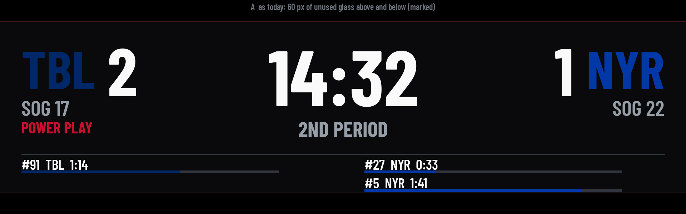
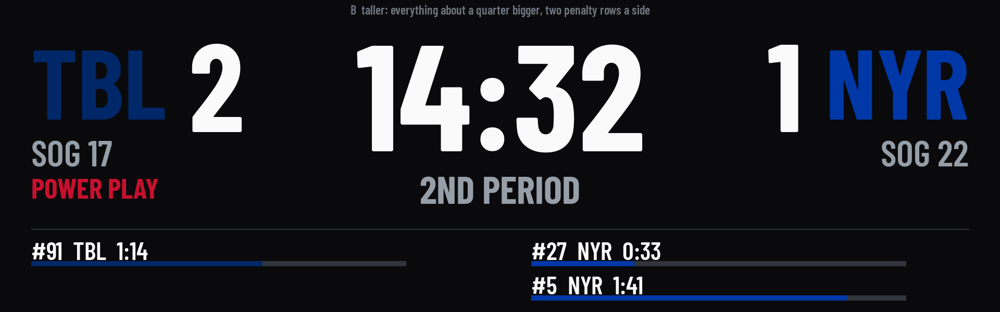
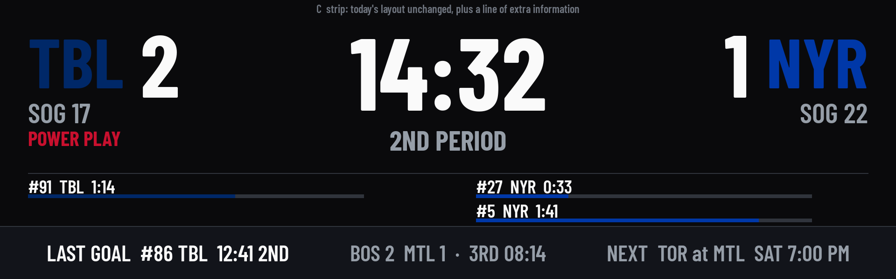
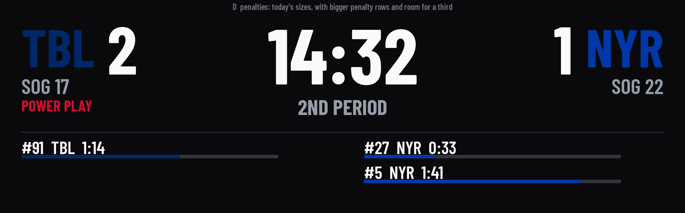
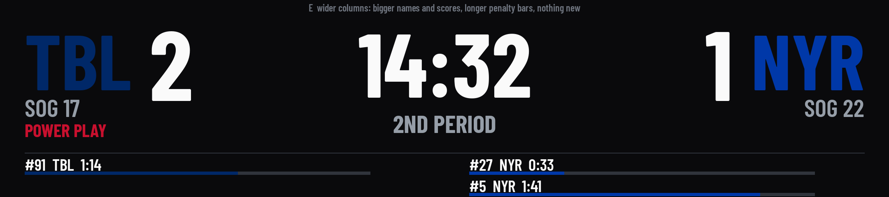
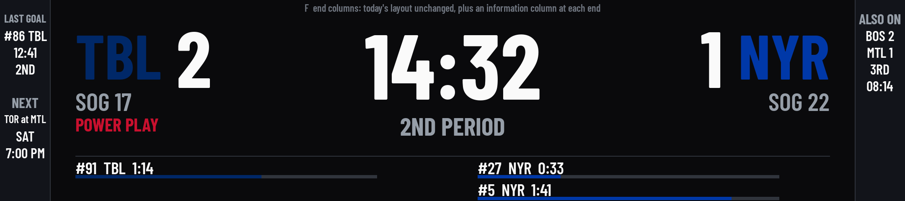

# Layout mock-ups for the real panel

**Chosen by the owner, 2026-09-21: C, the information strip.** The rest are kept as the record of what was considered. What C needed before it could be built is below, with what has since been built against it. The second, longer panel has its own pair of mock-ups at the end, not chosen yet.

The panel is 400x1280: **3.2:1**. The scoreboard frame is drawn at 1920x480,
which is 4:1, so turned and scaled it lands as 1280x320 with **40 px of unused
glass along each long edge** (measured 2026-09-19, `docs/hardware-checks.md`).

These are drawn at 1920x600, the panel's own shape, with the project's real
fonts and a real game state. They are pictures to choose from, **not
production code**: `render_mockups.py` draws them and nothing else uses it.

| | |
|---|---|
| **A** as today | The 4:1 frame with the unused bands marked. The baseline. |
| **B** taller | The same layout grown into the height: digits and names about a quarter bigger. Reads from further away. Two penalty rows a side. |
| **C** info strip | Today's layout untouched, and a strip underneath: last goal, another game, the next game. The strip's content needs data the panel does not get yet. |
| **D** penalties | Today's sizes, with bigger penalty rows and room for a third a side. The smallest text on the panel is the thing that grows. |

Whichever is chosen, two things come with it: the frame's height stops being a
constant (a panel that is 4:1 must still work), and the burn-in shift and the
stale-feed band are placed against the new layout and re-tested.

## What C needs

The strip shows three things. The panel has the first today, part of the
second, and none of the third.

| Slot | Has today | Needs |
|---|---|---|
| **Last goal** | the scorer's team and number, and when it happened (wall clock), in the state document | the period and the time in the period, which the reducer sees on the play and throws away |
| **Another game** | the panel may already subscribe to any game's state (`hockeytrack/games/*`) and gets today's list | one small retained document with every game's score today. Subscribing to a dozen live games for one line of text would be a dozen heartbeats every five seconds, per panel. |
| **Next game** | nothing beyond today's list | the panel's own next game. With game schedules (SCO-36) the cloud knows it, and it can ride in the config document. |

And two things that are not data:

- **The frame's height stops being a constant.** 1920x480 is written into the
  renderer and its tests. A 4:1 panel must still work, so the strip is what a
  taller panel gains, not something every panel is assumed to have.
- **Everything already placed against the old frame is placed again:** the
  burn-in shift (which only ever moves the frame up and sideways because the
  bottom edge was full), the stale-feed band, and the goal flash.

An empty slot must look deliberate: between games, or with no other game on,
the strip says less, never "undefined" and never yesterday's goal.

## What has been built

The strip is production code now: `device/scoreboard/render.py`
(`draw_strip`, `strip_lines`) draws it on a panel whose frame is taller than
the layout (SCO-55's `display.regions`), and `main.strip_for` decides what it
says. This file's `render_mockups.py` is still only a picture.

| Slot | Data | Panel |
|---|---|---|
| **Last goal** | `lastGoal.period` and `.time` in the state document (SCO-56, PR #52) | Kept per game and cleared when the game changes. A goal that arrives late is compared by period and time before it replaces the one on the strip, so an earlier goal cannot overwrite a later one; the flash follows the reducer's order and is unchanged. |
| **Another game** | the retained `hockeytrack/games/summary` (SCO-56), under the `hockeytrack/games/*` filter the device policy already allowed | Today's other live games take turns of twenty seconds each, the panel's own skipped; finals once no live game remains; empty otherwise. The turn is stepped on the frame's clock, which the stale band freezes, so the strip freezes with it. The summary carries no `start` and only LIVE and FINAL rows; games not started are not this slot's business. |
| **Next game** | `next: {gameId, away, home, start}` in the config document, composed by the director from the schedule (SCO-56, item 3) | Read strictly (`model.parse_next`: a next wrong in any way is dropped whole, and the game and settings in the same document still apply) and drawn only when a document carries it, in the sleep-hours zone; without a zone the time is left off. A document without one leaves the slot empty. |

Every string comes off the network and is read to the cloud's own spelling
(`model.parse_summary` holds the summary to 32 rows, two-to-four-letter
abbreviations, scores 0-99 and a fixed set of states); a document the panel
cannot read changes nothing and cannot stop the render loop. Each slot's text
is fitted to its width and then drawn on the slot's own clipped surface, so
nothing runs into the next slot or off the panel whatever it says. A 4:1
panel has no strip and its frame is byte for byte what it was, and so is
the longer panel's wider frame below: the strip is what a taller panel
gains (`device/tests/test_canvas.py`).

## The second panel: 440x1980, 4.5:1 -- choose one

**Not chosen yet.** The owner's second panel (received 2026-09-25) is longer
than the layout rather than taller, so the spare glass is at the ends: the
frame is 2160x480 and the layout sits in the middle with **120 px at each
end** (SCO-70). These two are drawn at that size, with the real fonts and the
same game as A to D.

| | |
|---|---|
| **E** wider columns | The side columns take the width: abbreviations and scores about a quarter bigger, longer penalty bars. Nothing new to feed; reads from further away. |
| **F** end columns | Today's layout untouched in the middle, and an information column at each end carrying what C's strip carries on the taller panel: last goal, another game, the next game. The data is what C's strip already reads (`main.strip_for`); the columns are narrow, so each slot is a heading and a few short lines. |

**Until one is chosen, the shipped code draws the ends as plain margins** in
the frame's background (`display.regions`), and the layout in the middle is
the 4:1 frame byte for byte. That is deliberate: nothing goes into the ends
that would later have to come out. Whichever is chosen comes with the same
two things C did: the shift and the stale band placed against it and
re-tested, and on F, the data.
